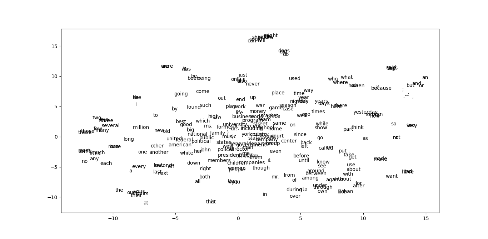

#### Implementation of a neural language model (multi-layer perceptron) from scratch for next word prediction

Dependencies:
* Python 3.7.0
* numpy 1.15.2
* pickle 4.0
* matplotlib 3.1.1
* scikit-learn 0.23.1

Organization of files is as follows:
```
./
├── data/
│   ├── raw_sentences.txt # Not obligatory: we do not use this in the code.
│   ├── test_inputs.npy
│   ├── test_targets.npy
│   ├── train_inputs.npy
│   ├── train_targets.npy
│   ├── valid_inputs.npy
│   ├── valid_targets.npy
│   └── vocab.npy
├── eval.py
├── main.py
├── model.pk
├── Network.py
└── tsne.py
```
## Train and evaluate validation during training
        
Run main.py in a Python IDE or the terminal by typing:
```python main.py```

This will train the network for 20 epochs using a batch size of 100 and a learning rate of 0.01.
During training, at each epoch, it will evaluate the model on validation data. It will take around 14 minutes.

It will save the trained model in new_model.pk.

To observe convergence curves presented in the repo of the project, please set ```plot = True``` in main.py file.
Then, run main.py. Note that this will takes more time since we will keep some intermediate validations to plot the curve.

## Evaluate the model on test data and predict the next word

Run eval.py in a Python IDE or the terminal by typing:
```python eval.py```

It will take trained model.pk and test data as inputs and then generate test accuracy results.

It will also give the prediction results (using the same model) for
'city of new',
'life in the'
'he is the'.

It will also generate some additional predictions for
'it is my',
'i want to',
'a part of',
'it was much',
'what other people',
'four , three'.

Note that you can change the model and use new_model.pk, if it is ready, by simply changing:
```network = pickle.load(open('model.pk','rb'))``` with
```network = pickle.load(open('new_model.pk','rb'))``` in the eval.py.

## Generate t-sne plot

Run tsne.py in a Python IDE or the terminal by typing:
```python tsne.py```

By using model.pk and vocab.npy it will show a 2-dimensional plot of the embeddings.
It will also save it as tsne.png

You can change the model and use new_model.pk, if it is ready, by simply changing:
```network = pickle.load(open('model.pk','rb'))``` with
```network = pickle.load(open('new_model.pk','rb'))``` in the tsne.py.

## An example of outputs

main.py:
```
-> Training data is loaded.
-> Training data is shuffled.
-> Validation data is loaded.
-> Batch size:  100 , number of epoch:  20 , learning rate:  0.01
-> Epoch:  0
-> Epoch:  1
-> Epoch:  2
-> Epoch:  3
-> Epoch:  4
-> Epoch:  5
-> Epoch:  6
-> Epoch:  7
-> Epoch:  8
-> Epoch:  9
-> Epoch:  10
-> Epoch:  11
-> Epoch:  12
-> Epoch:  13
-> Epoch:  14
-> Epoch:  15
-> Epoch:  16
-> Epoch:  17
-> Epoch:  18
-> Epoch:  19
-> Final train accuracy is 36.979 %
-> Final validation accuracy is 35.772 %
-> new_model.pk is saved.
-> Execution completed.
```
Accuracy and loss results during 20 epochs using 0.01 learning rate and 100 batch size:
<p align="center"></p>

eval.py:
```
-> Testing is started.
--> model.pk is loaded.
--> Test accuracy: 35.854 %
-> End of the test.
--------------------------------------------------
-> Next word prediction is started. Used model is model.pk.
--> Prediction results:
city of new -> york
life in the -> world
he is the -> best
Additional predictions:
it is my -> business
i want to -> be
a part of -> it
it was much -> more
what other people -> said
four , three -> ,
-> End of the prediction.
```
tsne.py:
```
-> vocab.pny is loaded.
-> model.pk is loaded.
-> 2d embeddings are created.
-> tsne.png saved.
```

t-SNE plot:
<p align="center"></p>

Clusters: "should, would, may, might, could, can, will", "does, did, do", "said, says, say", "but, and, or", "what, who, where, when, how", "just, only, still, also, never", "was, 's, is", "be, been, being" and "were, are":
<p align="center"></p>

Clusters: "these, those", "few, many", "three, four, five, several", "more, less", "little, much, any" and "most, some":
<p align="center"></p>

Cluster: "our, their, my, your, his":
<p align="center"></p>

## References
"Lecture 6: Backpropagation - youtube." https://www.youtube.com/watch?v=dBu77Y5a6Aabchannel=MichiganOnline. (Accessed on 05/01/2021).

"Derivative of the softmax function and the categorical cross-entropy loss | by thomaskurbiel | apr, 2021 | towards data science."https://towardsdatascience.com/derivativeof-the-softmax-function-and-the-categorical-cross-entropy-loss-ffceefc081d1. (Accessed on 05/02/2021).

"Derivative of the sigmoid function | by arc | towards data science."https://towardsdatascience.com/derivative-of-the-sigmoid-function-536880cf918e. (Accessed on 04/26/2021).

"Activation functions and weight initialization in deep learning | by sakesh pusuluri | medium." https://medium.com/@sakeshpusuluri123/activation-functions-and-weightinitialization-in-deep-learning-ebc326e62a5c. (Accessed on 05/01/2021).

"Weight initialization techniques in neural networks | by saurabh yadav | towards data science." https://towardsdatascience.com/weight-initialization-techniques-in-neuralnetworks-26c649eb3b78. (Accessed on 04/29/2021).

"Initializing neural networks - deeplearning.ai." https://www.deeplearning.ai/ainotes/initialization/. (Accessed on 04/29/2021).

"Section 4 (week 4)." https://cs230.stanford.edu/section/4/. (Accessed on 04/29/2021).

##### This project was implemented for CmpE 597 Deep Learning Course of Bogazici University.
